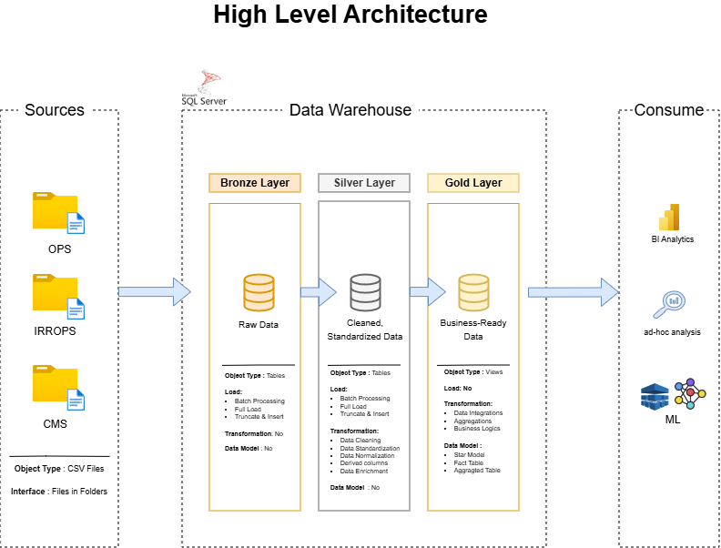

# Flight Crew Management Data Warehouse and Analytics Project

Welcome to the **Flight Crew Management Data Warehouse and Analytics Project** repository.  
This project demonstrates an end-to-end data warehousing and analytics solution for airline operations, from raw data ingestion to analytics-ready reporting. Designed as a portfolio project, it follows industry best practices in data engineering, data modeling, and SQL analytics.

---

## 🏗️ Data Architecture

The data architecture for this project follows Medallion Architecture with **Bronze**, **Silver**, and **Gold** layers.



1. **Bronze Layer**  
   Stores raw airline operational data as-is from source CSV files. Data is ingested into a SQL Server database without transformation.

2. **Silver Layer**  
   Applies data cleansing, standardization, deduplication, and business rule validation to prepare high-quality, conformed datasets.

3. **Gold Layer**  
   Contains analytics-ready data modeled using a star schema, optimized for reporting and analytical queries.

---

## 📖 Project Overview

This project involves:

1. **Data Architecture**  
   Designing a modern data warehouse using Medallion Architecture (Bronze, Silver, Gold).

2. **ETL Pipelines**  
   Extracting, transforming, and loading airline operational data into SQL Server.

3. **Data Modeling**  
   Developing fact and dimension tables optimized for analytical queries.

4. **Analytics and Reporting**  
   Creating SQL-based analytical queries to generate actionable operational insights.

---

## 🎯 Skills Demonstrated

This repository is suitable for showcasing expertise in:

- SQL Development  
- Data Architecture  
- Data Engineering  
- ETL Pipeline Development  
- Data Modeling  
- Data Analytics  

---

## 🛠️ Tools and Resources

All tools used in this project are free.

- **Datasets:** CSV files simulating airline operations (flights, crew, delays, weather)
- **SQL Server Express:** Database engine for hosting the data warehouse
- **SQL Server Management Studio (SSMS):** SQL Server management and query interface
- **Git and GitHub:** Version control and collaboration
- **DrawIO:** Architecture, data model, and data flow diagrams
- **Notion:** Project planning and task tracking

---

## 🚀 Project Requirements

### Building the Data Warehouse (Data Engineering)

#### Objective
Develop a modern SQL Server–based data warehouse to consolidate flight operations, crew management, delays, and weather data, enabling analytical reporting and informed decision-making.

#### Specifications

- **Data Sources**  
  Import multiple airline operational datasets provided as CSV files:
  - Flights
  - Airports
  - Aircraft
  - Crew
  - Crew assignments
  - Delay events
  - Weather windows

- **Data Quality**  
  Cleanse and resolve data quality issues, including:
  - Duplicate records
  - Inconsistent date and timestamp formats
  - Invalid airport codes
  - Cancelled flights with actual timestamps
  - Negative or malformed delay values
  - Overlapping or invalid crew duty windows

- **Integration**  
  Combine all datasets into a single analytical data model:
  - Flights linked to routes, airports, aircraft, and dates
  - Crew assignments linked to flights and crew members
  - Delay events linked to standardized delay categories
  - Weather windows linked to impacted airports

- **Scope**  
  - Focus on the latest 24 months of data (approximately 50,000 flights)
  - No historization or slowly changing dimensions required
  - Retain the most recent valid record when duplicates exist

- **Documentation**  
  Provide clear documentation for data architecture, data models, and transformation logic to support analytics and business users.

---

### BI and Analytics (Data Analysis)

#### Objective
Develop SQL-based analytics to deliver insights into:

- Flight on-time performance
- Crew utilization and duty hours
- Delay root cause analysis
- Route, airport, and hub performance

These insights support operational monitoring and data-driven decision-making.

---

## 📂 Repository Structure
```
flight-crew-data-warehouse/
│
├── datasets/ # Raw CSV datasets
│
├── docs/ # Documentation and diagrams
│ ├── etl.drawio # ETL process design
│ ├── data_architecture.drawio # Medallion architecture diagram
│ ├── data_catalog.md # Dataset and column metadata
│ ├── data_flow.drawio # Data flow diagram
│ ├── data_models.drawio # Star schema and dimensional models
│ ├── naming-conventions.md # Naming standards
│
├── scripts/ # SQL scripts
│ ├── bronze/ # Raw ingestion scripts
│ ├── silver/ # Data cleansing and transformation
│ ├── gold/ # Analytics-ready models
│
├── tests/ # Data quality and validation checks
│
├── README.md # Project overview
├── LICENSE # License information
├── .gitignore # Git ignore rules
└── requirements.txt # Project requirements and setup notes
```
---

## 🛡️ License

This project is licensed under the [MIT License](LICENSE).
